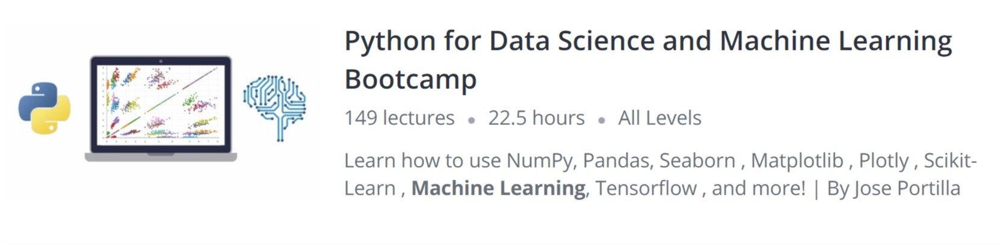
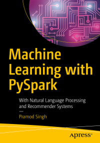

### `Python For Data Analytics and Machine learning`

##### Learning Python for Data Science
-Taught by Jose Portilla Course website: **https://www.udemy.com/python-for-data-science-and-machine-learning-bootcamp/**

-- Jupyter notebook for Exercise and Projects from Udemy course: Python data science and machine learning bootcamp.
-- This course offers fundamentals of Data Science and Machine Learning using python. This is my learning process to understand Python and hopefully move towards PySpark and SparkR.

#### Content

    - Python for Data Analysis using NumPy 
    - Schema Evolutions
    - Python for Data Analysis - Pandas
    - Python for Data Visualization - Matplotlib
    - Python for Data Visualization - Seaborn
    - Linear Regression and other Machine learning algorithms
    - Web Scrapping using BeautifulSoup4
    - Big data with Spark

- `Using MatplotLib package in Python for data visualization. Matplotlib is similar to ggplot2 in R which is a widely used package for data visualization. `

- https://github.com/dev-pasa/PythonForData/blob/master/MatPlotlibForVisual.ipynb

- [comment]: #Course

#### Source: 
- For PySpark 
- The Learning materials for PySpark are from Machine Learning with PySpark by Pramod Singh (Apress, 2019).
*** https://github.com/Apress/machine-learning-with-pyspark
- [comment]: #cover

